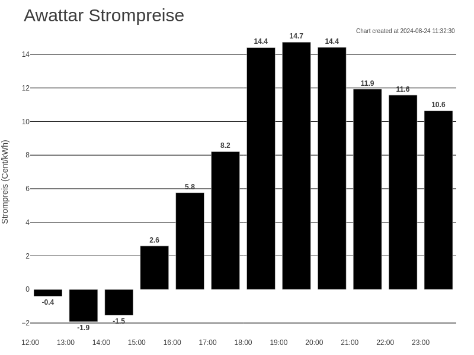

This project consists of a server and some code for the client (Kindle v4) to display the current [Awattar](https://www.awattar.at/services/charts/hourly) prices.

This repository builds on the excellent work of https://github.com/x-magic/kindle-weather-stand-alone

## awattarapi.py 
This fetches the api from Awattar every hour and creates a new png locally. In parallel, it can serve the PNG via Flask on `localhost:5000/awattar.png`.
Sorry for having it in German, but adapting this to your own preference won't be too hard I assume.
The script automatically applies the HOURLY tariff's markup plus VAT (MwSt). What is of course not included is your electricity provider's cost ("Netzkosten").

### Example image

## Kindle folder
This is a (not very clean) KUAL extension to display the above generated PNG. 
To start it, jailbreak your Kindle and install KUAL. The extension folder needs to be copied onto the Kindle in the extensions folder on the device.

The script's operation is very easy: 
1. First, it turns off unneeded services to save power.
2. Then it enters an infinite loop
3. Wifi is enabled
4. The image is fetched (**Don't forget:** change the url to your own server at home)
5. If successful, show image
6. If unsuccessful, show error image
7. In both cases, disable wifi again to save power
8. Put device to sleep for 6 hours

By doing this, my kindle survives around 6 weeks without a recharge.
